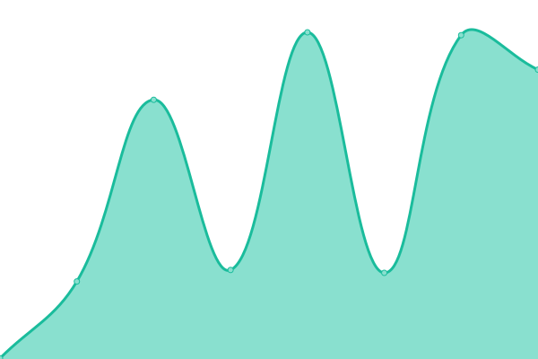
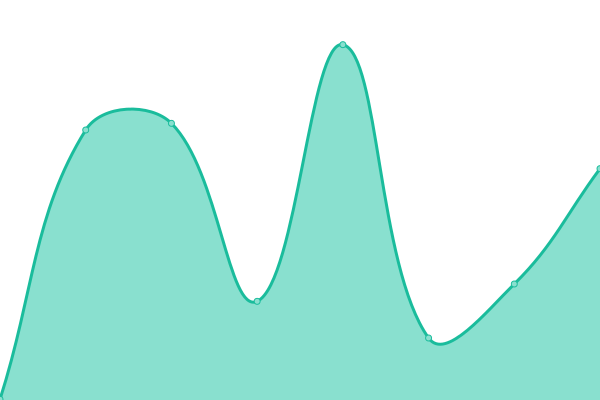
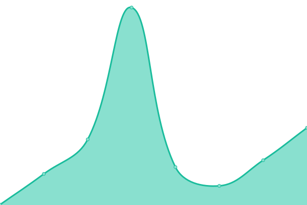
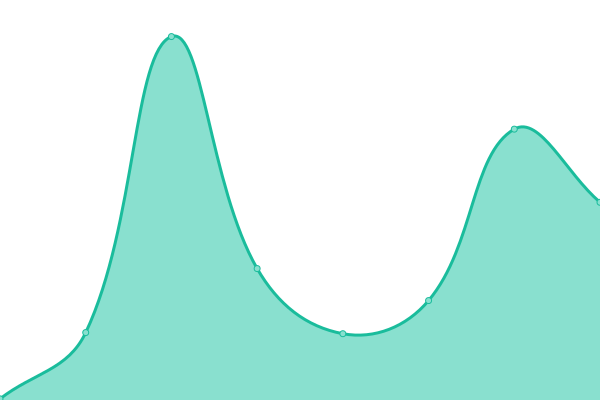

# [📈 Live Status](https://AutohostAI.github.io/AutohostAI): <!--live status--> **🟩 All systems operational**

This repository contains the open-source uptime monitor and status page for [Autohost](https://www.autohost.ai), powered by [Upptime](https://github.com/upptime/upptime).

With [Upptime](https://upptime.js.org), you can get your own unlimited and free uptime monitor and status page, powered entirely by a GitHub repository. We use [Issues](https://github.com/AutohostAI/AutohostAI/issues) as incident reports, [Actions](https://github.com/AutohostAI/AutohostAI/actions) as uptime monitors, and [Pages](https://AutohostAI.github.io/AutohostAI) for the status page.

<!--start: status pages-->
<!-- This summary is generated by Upptime (https://github.com/upptime/upptime) -->
<!-- Do not edit this manually, your changes will be overwritten -->
<!-- prettier-ignore -->
| URL | Status | History | Response Time | Uptime |
| --- | ------ | ------- | ------------- | ------ |
|  Embed Server | 🟩 Up | [embed-server.yml](https://github.com/AutohostAI/AutohostAI/commits/HEAD/history/embed-server.yml) | 

 198ms
     
 | 

<a href="https://status.autohost.dev/history/embed-server">100.00%</a>
    

|  SDK API | 🟩 Up | [sdk-api.yml](https://github.com/AutohostAI/AutohostAI/commits/HEAD/history/sdk-api.yml) | 

 239ms
     
 | 

<a href="https://status.autohost.dev/history/sdk-api">100.00%</a>
    

|  Dashboard API | 🟩 Up | [dashboard-api.yml](https://github.com/AutohostAI/AutohostAI/commits/HEAD/history/dashboard-api.yml) | 

 413ms
     
 | 

<a href="https://status.autohost.dev/history/dashboard-api">100.00%</a>
    

|  Dashboard App | 🟩 Up | [dashboard-app.yml](https://github.com/AutohostAI/AutohostAI/commits/HEAD/history/dashboard-app.yml) | 

 4369ms
     
 | 

<a href="https://status.autohost.dev/history/dashboard-app">99.46%</a>
    

|  Guest Portal | 🟩 Up | [guest-portal.yml](https://github.com/AutohostAI/AutohostAI/commits/HEAD/history/guest-portal.yml) | 

 460ms
     
 | 

<a href="https://status.autohost.dev/history/guest-portal">97.32%</a>
    

|  [Dev Docs](https://docs.autohost.ai) | 🟩 Up | [dev-docs.yml](https://github.com/AutohostAI/AutohostAI/commits/HEAD/history/dev-docs.yml) | 

 124ms
     
 | 

<a href="https://status.autohost.dev/history/dev-docs">100.00%</a>
    

|  [Threat Intel](https://www.openreputationapi.com) | 🟩 Up | [threat-intel.yml](https://github.com/AutohostAI/AutohostAI/commits/HEAD/history/threat-intel.yml) | 

 123ms
     
 | 

<a href="https://status.autohost.dev/history/threat-intel">100.00%</a>
    

|  [Global Watchlist](https://www.sanctionswatchlist.com) | 🟩 Up | [global-watchlist.yml](https://github.com/AutohostAI/AutohostAI/commits/HEAD/history/global-watchlist.yml) | 

 112ms
     
 | 

<a href="https://status.autohost.dev/history/global-watchlist">100.00%</a>
    

|  [Tenant Evictions](https://www.opentenantevictions.com) | 🟩 Up | [tenant-evictions.yml](https://github.com/AutohostAI/AutohostAI/commits/HEAD/history/tenant-evictions.yml) | 

 100ms
     
 | 

<a href="https://status.autohost.dev/history/tenant-evictions">100.00%</a>
    

|  [Marketing Website](https://www.autohost.ai) | 🟩 Up | [marketing-website.yml](https://github.com/AutohostAI/AutohostAI/commits/HEAD/history/marketing-website.yml) | 

 301ms
     
 | 

<a href="https://status.autohost.dev/history/marketing-website">100.00%</a>
    

<!--end: status pages-->

[**Visit our status website →**](https://AutohostAI.github.io/AutohostAI)

## 📄 License

- Powered by: [Upptime](https://github.com/upptime/upptime)
- Code: [MIT](./LICENSE) © [Anand Chowdhary](https://anandchowdhary.com), supported by [Pabio](https://pabio.com)
- Data in the `./history` directory: [Open Database License](https://opendatacommons.org/licenses/odbl/1-0/)
